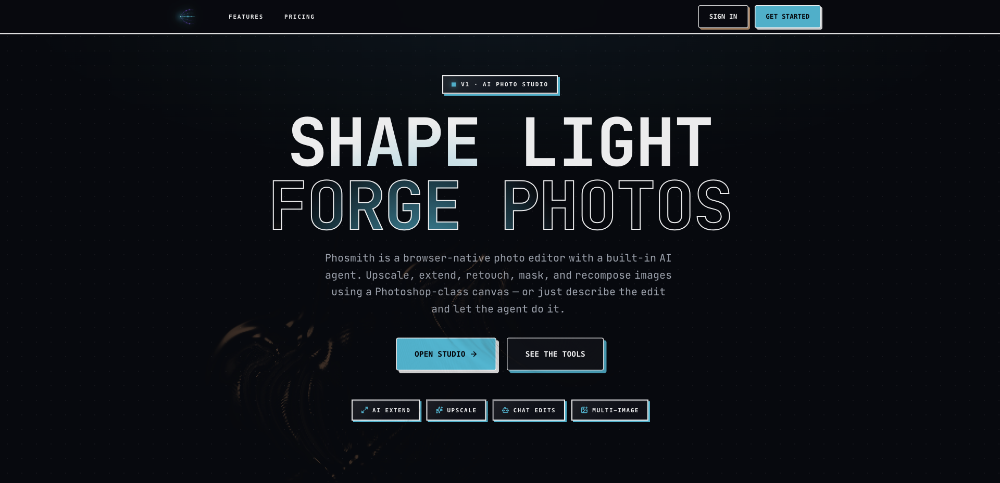
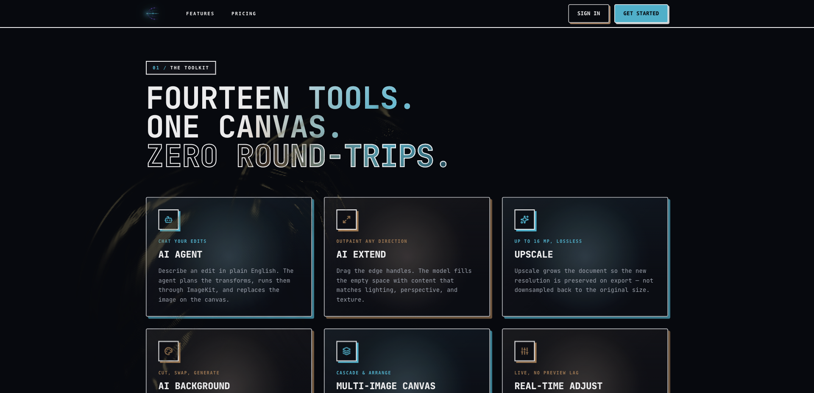
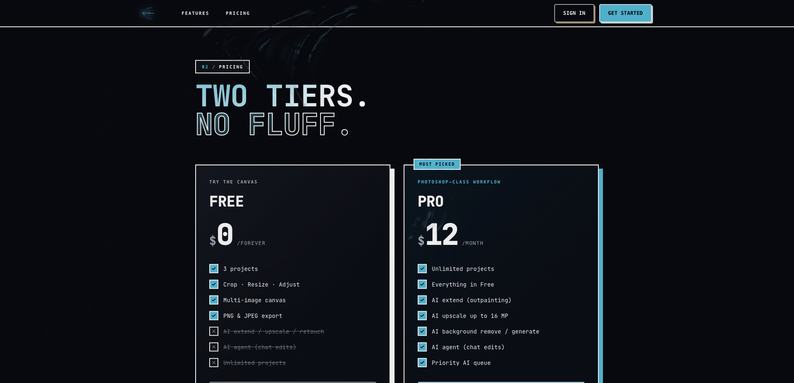
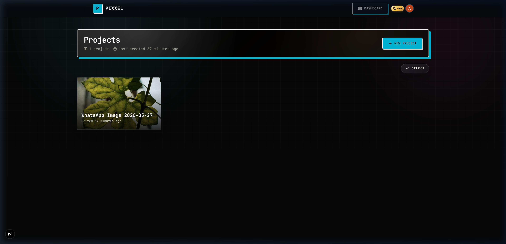
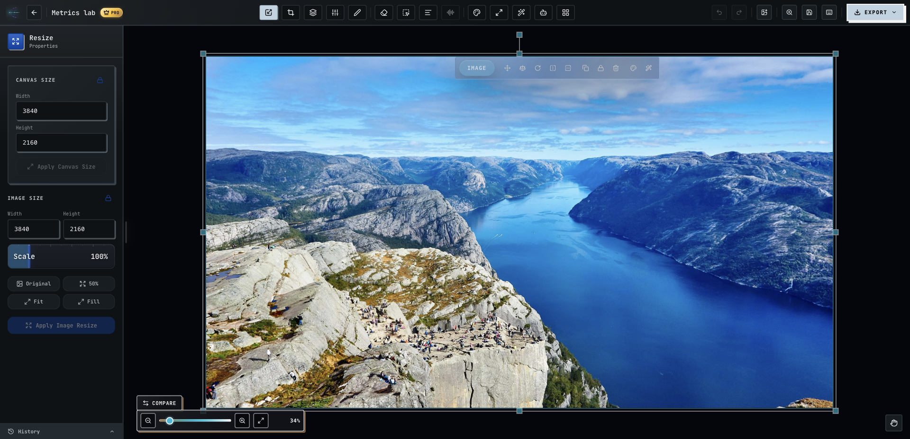

<p align="center">
  <svg xmlns="http://www.w3.org/2000/svg" width="48" height="48" viewBox="0 0 32 32">
    <rect width="32" height="32" rx="7" fill="#0B0D12"/>
    <path d="M16 3 C 16.7 9.6, 22.4 15.3, 29 16 C 22.4 16.7, 16.7 22.4, 16 29 C 15.3 22.4, 9.6 16.7, 3 16 C 9.6 15.3, 15.3 9.6, 16 3 Z" fill="#06B8D4"/>
  </svg>
</p>

<h1 align="center">Phosmith — AI Image Studio</h1>

<p align="center">
  <strong>A professional-grade, AI-powered image editor built for the browser.</strong><br />
  Photoshop-class editing in WebGL2, with the AI running in your browser by default and optional Python services for the heavy models.
</p>

<p align="center">
  
  
  
  
  
  
  
</p>

---

<p align="center">
  
</p>

---

## Table of Contents

- [Overview](#overview)
- [Screenshots](#-screenshots)
- [Key Features](#-key-features)
- [Architecture](#-architecture)
- [Editor Tools](#-editor-tools)
- [AI Capabilities](#-ai-capabilities)
- [The Megashader Engine](#-the-megashader-engine)
- [Agent Command System](#-agent-command-system)
- [Dashboard & Project Management](#-dashboard--project-management)
- [Tech Stack](#-tech-stack)
- [Getting Started](#-getting-started)
- [Environment Variables](#-environment-variables)
- [Local AI Services](#-local-ai-services)
- [AI Agent (Agentic Editing)](#-ai-agent-agentic-editing)
- [Scripts Reference](#-scripts-reference)
- [Deployment](#-deployment)
- [Learn More](#-learn-more)

---

## Overview

Phosmith is a state-of-the-art web-based image editor that seamlessly blends professional-grade adjustment tools with advanced AI capabilities. It features a custom WebGL2 compositing engine (the **Megashader**), non-destructive mask layers, an AI agentic editing assistant with a collage command registry, and support for local large language models and computer vision models.

The editor runs entirely in the browser — image processing is handled by the GPU via WebGL2 shaders, and AI inference is offloaded to a local Python FastAPI service. No cloud GPU required.

This project uses **[Bun](https://bun.sh)** as the sole package manager and runtime. Do not use npm, yarn, or pnpm.

---

## 📸 Screenshots

### Landing Page

The marketing site showcases the neobrutalist design system with a bold hero, scrolling feature ticker, and stats bar.

<p align="center">
  
</p>

### Features & Pricing

The toolkit section highlights nine core tools (AI Agent, AI Extend, Upscale, etc.) while the pricing section offers a clear Free vs Pro comparison.

<table>
  <tr>
    <td></td>
    <td></td>
  </tr>
  <tr>
    <td align="center"><em>Features — The Toolkit</em></td>
    <td align="center"><em>Pricing — Free & Pro Tiers</em></td>
  </tr>
</table>

### Dashboard

The project dashboard provides a grid view of all saved projects with live canvas thumbnails, creation timestamps, and bulk selection.

<p align="center">
  
</p>

### Editor

The full-featured editor with a 14-tool topbar, a left-hand property panel (shown: Resize tool), the WebGL2 canvas with selection handles, and a zoom slider at the bottom.

<p align="center">
  
</p>

---

## ✨ Key Features

| Category | Highlights |
|---|---|
| **Non-Destructive Editing** | 100+ procedural mask layers composited in real-time on the GPU |
| **Runs without a backend** | Selection, text grounding and auto-crop run in the browser; only depth and object-fill need a service |
| **AI Selection & Masking** | Click / box select and subject cutout from one local model (SlimSAM), magic wand, marquee, magnetic lasso, natural-language masks, depth selection when the masking service runs |
| **Professional Adjustments** | 15+ parameters — Exposure, Curves, Temperature, Vibrance, Film Grain, and more |
| **AI Agent Chat** | Type any edit or collage prompt — the agent executes it autonomously with a full command registry |
| **Collage Builder** | 14 grid templates plus the **Composer**: 8 generative layout families (mosaic, shards, strata, orbit, prints, lens, silhouette, seamless tapestry), empty slots you click to fill, drag-to-swap photos, and a Gemini art director that reads your brief |
| **AI Background** | Generate, replace, or remove backgrounds using AI inpainting/outpainting |
| **AI Extender** | Drag the frame outward and fill the new area (ImageKit generative fill), with prompt clean-up, a soft preview while the real result finishes, and a background poller that swaps it in |
| **AI Object Remover** | Click any object → SlimSAM segments it in-browser → LaMa (service) or Stable Diffusion (hosted) fills the hole |
| **NL Masking** | Describe a region in plain text ("the dog on the left", "everything except the sky") and the agent masks it |
| **Rich Text Engine** | Google Fonts integration, text effects, shadows, outlines, curved text |
| **Export** | PNG / JPEG / WebP at 1×, 2×, or 3× resolution, plus clipboard copy |

---

## 🏛 Architecture

```
┌──────────────────────────────────────────────────────┐
│                   Next.js 16 (App Router)             │
│  ┌──────────┐  ┌──────────┐  ┌────────────────────┐  │
│  │ Dashboard │  │  Editor  │  │   API Routes       │  │
│  │  (React)  │  │ (Fabric  │  │  /api/ai/*         │  │
│  │           │  │  + WebGL) │  │  /api/canvas/*     │  │
│  └──────────┘  └────┬─────┘  │  /api/imagekit/*    │  │
│                     │        │  /api/neon/*         │  │
│                     ▼        └────────────────────┘  │
│            ┌────────────┐                            │
│            │ Megashader  │   ┌─────────────────────┐  │
│            │  (WebGL2    │   │ In-browser AI       │  │
│            │   GLSL)     │   │ (transformers.js)   │  │
│            └────────────┘   │ SlimSAM (+ CLIPSeg  │  │
│                             │ for text grounding) │  │
│                             │                     │  │
│                             └─────────────────────┘  │
│                             ┌─────────────────────┐  │
│                             │ Optional services   │  │
│                             │ (FastAPI, HF Space) │  │
│                             │ masking :8002 —     │  │
│                             │  rembg/BiRefNet,    │  │
│                             │  SAM 3.1, Depth     │  │
│                             │ segment :8001 —     │  │
│                             │  LaMa, shape fill   │  │
│                             └─────────────────────┘  │
│  ┌──────────┐  ┌──────────┐  ┌────────────────────┐  │
│  │  Clerk   │  │  Neon    │  │  ImageKit CDN      │  │
│  │  (Auth)  │  │ (Postgres│  │  (Image Storage    │  │
│  │          │  │  + Prisma│  │   + Transforms)    │  │
│  └──────────┘  └──────────┘  └────────────────────┘  │
└──────────────────────────────────────────────────────┘
```

---

## 🛠 Editor Tools

The editor topbar exposes **14 tools**, each with its own property panel:

### Core Editing

| Tool | Description |
|---|---|
| **Resize** | Change canvas and image dimensions. Includes Original, 50%, Fit, and Fill presets. Maintains aspect ratio with linked width/height fields. |
| **Crop** | Freeform and preset ratio cropping (1:1, 4:5, 16:9, 9:16, 2:3, etc.) with a live preview overlay. **AI Auto-Crop** reads the photo first — a Gemini vision pass reports scene type, subjects, which way they face, must-keep details, eye line and horizon; the subject edge is tightened with the in-browser matte; then the crop is composed (lead room, eyes on the upper third, horizon on a third, never cutting what must stay). Four strategies: subject-aware, aspect-ratio, content-fill, depth-guided. Runs entirely in the browser. |
| **Images** | Multi-layer image management. Upload, reorder, rename, merge, show/hide, and duplicate layers. Drag-and-drop support. |
| **Adjust** | Professional-grade color and tone adjustments — see [Adjustments](#adjustments) below. |
| **Draw** | Freehand drawing with configurable brush size, color, and opacity. Supports pen/marker styles. |
| **Erase** | Smart eraser with AI Object Remover mode: click an object → SlimSAM segments it in-browser → the hole is filled with background content (LaMa on the service, Stable Diffusion as the hosted fallback). |
| **Mask** | Comprehensive selection and masking system — see [Masking Tools](#masking-tools) below. |
| **Text** | Rich text engine with 50+ Google Fonts, text shadows, outlines, letter spacing, and alignment controls. |

### AI Tools (Pro)

| Tool | Description |
|---|---|
| **AI Background** | Generate new backgrounds from text prompts, remove backgrounds entirely, or replace them with AI-generated scenes. |
| **AI Extender** | Expand canvas boundaries (outpaint) in any direction with contextually coherent AI-generated content. |
| **AI Edit** | Describe edits in natural language. The AI plan engine generates an edit sequence applied via ImageKit transforms. |
| **Agent** | A fully autonomous agentic editing assistant — see [AI Agent](#-ai-agent-agentic-editing). Also handles collage commands via natural language. |
| **Collage** | 14 grid templates with rounded/circle frames, drop shadows, per-cell Replace & Edit, and AI-generated themed backgrounds — plus the **Composer**, which solves layouts from your brief across 8 families, scores candidates, leaves clickable empty slots, and lets you drag photos to swap or move them. |

---

### Adjustments

The **Adjust** tool provides 15+ parameters, all computed in real-time via WebGL2 shaders:

| Parameter | Range | Description |
|---|---|---|
| Brightness | −100 → +100 | Overall light level |
| Contrast | −100 → +100 | Tonal range expansion/compression |
| Saturation | −100 → +100 | Color intensity |
| Vibrance | −100 → +100 | Selective saturation (protects skin tones) |
| Exposure | −2.0 → +2.0 | Simulated f-stop exposure shift |
| Temperature | −100 → +100 | Warm ↔ Cool white balance |
| Tint | −100 → +100 | Green ↔ Magenta shift |
| Hue | −180° → +180° | Global hue rotation |
| Highlights | −100 → +100 | Recover or boost highlight detail |
| Shadows | −100 → +100 | Recover or crush shadow detail |
| Sharpness | 0 → +100 | Unsharp mask sharpening |
| Blur | 0 → +100 | Gaussian blur |
| Noise | 0 → +100 | Add luminance noise |
| Film Grain | 0 → +100 | Cinematic grain simulation |
| Curves | Per-channel | RGB and per-channel curves with control points |

---

### Masking Tools

The mask system is organized into four categories:

#### AI Tools
- **Select Subject / Select Background** — One-click subject isolation. In the browser this is **SlimSAM** prompted with a saliency box; **rembg / BiRefNet** is used instead when the masking service is running. Background mode inverts the matte, and a sensitivity slider plus fill-holes toggle clean up soft mattes.
- **Click to Select** — Click (or drag a box) and the object boundary is predicted by **SlimSAM in the browser**. The service's SAM 3.1 is not used for this any more. Shift-click adds, Alt-click subtracts, and "Refine" composites each result into the selected layer.
- **Magic Wand** — Tolerance-based flood fill on the unfiltered source pixels, with contiguous, anti-alias and 1×1/3×3/5×5 sampling options.
- **Marquee** — Rectangular and elliptical selections (Shift to constrain, Alt to draw from the centre).
- **Detect All Subjects** — Enumerates every subject as clickable chips (person 1, the dog, …). Needs the masking service: it uses **SAM 3.1** open-vocabulary detection, with a saliency-blob fallback when SAM is unavailable.
- **Depth Range** — Selects by distance using **Depth Anything V2** on the masking service. Without the service this tool reports that it needs it.
- **Natural Language** — Describe the region in plain text ("the red jacket", "everything except the sky"). The plan comes from Gemini (or an on-device rule parser), then each step resolves through subject detection, text grounding (**SAM 3.1** on the service, **CLIPSeg** in the browser), depth, luminance, colour or geometry — composed with add / subtract / intersect so every part stays editable.
- **Select-and-Mask edge controls** — Boundary, Smooth and Contrast per texture layer, derived non-cumulatively from the pristine matte.

#### Draw Selection
- **Selection Brush** — Paint a selection mask with adjustable size and feather. Includes *Edge Snapping* mode (bilateral filter) that snaps brush strokes to detected edges.
- **Lasso Select** — Three modes: freehand lasso, polygonal lasso, and *Magnetic Lasso* that automatically snaps to edges.

#### Range Selection
- **Color Range** — Eyedropper-based selection. Pick a color, adjust tolerance, and select all pixels within that range.
- **Luminance Range** — Select pixels based on brightness thresholds.
- **Linear Gradient** — Create a gradient mask with configurable angle, spread, and falloff.
- **Radial Gradient** — Create a radial gradient mask from a center point.

#### Destructive
- **Quick Erase** — One-click background removal that permanently modifies the image layer.

All non-destructive selections are composited as **mask layers** in the Megashader engine — reorderable, toggleable, invertible, and adjustable at any time.

#### Mask Boundary Extension
Every mask layer (including AI-detected subjects) supports a **Boundary** slider that grows or shrinks the mask edge by an absolute pixel amount. The pristine texture is preserved under `baseTextureKey` so setting boundary to 0 always restores the original edge.

---

## 🤖 AI Capabilities

### Computer Vision Models

**SlimSAM is the only segmentation model that runs locally.** Everything else is
either a cloud API or an optional service you deploy yourself.

**In the browser** (transformers.js, WebGPU → WASM, downloaded once and cached):

| Model | Task | Size |
|---|---|---|
| **SlimSAM** (`Xenova/slimsam-77-uniform`) | Click select, box select, **and** one-click Select Subject (a saliency box + prompt points seed it, and the best-scoring candidate mask wins) | ~40 MB |
| **CLIPSeg** (`Xenova/clipseg-rd64-refined`) | Text grounding for natural-language masks — the one job SlimSAM cannot do without a service | ~150 MB |

Models that used to run in the browser and were removed on purpose: **SAM 3
Tracker** and **MODNet** (duplicated SlimSAM's job), **RMBG-1.4** (subject cutout
now comes from SlimSAM), **Depth Anything V2** (depth is a service capability),
and the hosted **SegFormer / DETR** segmentation fallback.

**On the optional Python services** (both deployable to a Hugging Face Space):

| Model | Task | Service |
|---|---|---|
| **rembg** (`isnet-general-use` default, BiRefNet optional) | Subject matte | masking (:8002) |
| **SAM 3.1** (`facebook/sam3.1`, gated checkpoint) | Click / box prompts, multi-subject detection, open-vocabulary grounding | masking (:8002) |
| **Depth Anything V2 Small** | Monocular depth — the only source of depth masks and depth-guided crop | masking (:8002) |
| **LaMa** (`simple-lama-inpainting`) | Object-removal fill | segment (:8001) |

**Hosted APIs:**

| Model / service | Task | Provider |
|---|---|---|
| **Gemini 3.5 Flash** | Edit planner, 12-axis judge, mask planner, collage art director, crop analysis, pixel-stretch planner | Google AI API |
| **FLUX.1-schnell** | AI background / collage background generation | HuggingFace Inference API |
| **Stable Diffusion Inpainting** | Object-fill fallback when LaMa is not running | HuggingFace Inference API |
| **ImageKit generative fill** | AI Extender outpainting | ImageKit |

### AI Transform Pipeline

- **Background generation** — Text-to-image via `/api/ai/background` (FLUX.1; `raw:true` mode for illustration/watercolor prompts)
- **Inpainting** — Fill masked regions via `/api/ai/inpaint` (LaMa local-first, HF Stable Diffusion fallback; crops to padded mask bounds)
- **Outpainting** — Expand canvas boundaries via `/api/ai/extend`
- **Edit planning** — Natural language → edit parameter mapping via `/api/ai/edit-plan` (Gemini, heuristic fallback, grade loop with Gemini judge + critic)
- **Mask planning** — Natural language → mask step plan via `/api/ai/mask-plan`
- **Auto-crop** — reads the photo via `/api/ai/crop-analyze` (Gemini vision), then composes the crop in the browser (`src/lib/auto-crop-core.js`); `/api/ai/auto-crop` remains as the service-side pipeline but the editor no longer needs it

### AI Routing

`src/lib/ai-routing.js` is the single source of truth for where each capability runs. Each capability has a user preference (`auto | client | server`) stored in localStorage. `auto` = server-first with runtime fallback. The Mask tool's "AI Processing" section exposes per-capability toggles.

### Image Analysis

- **Color extraction** — Dominant color palette via `fast-average-color` (used to seed AI background prompts)
- **Histogram analysis** — Per-channel RGB and luminance histograms
- **Image fingerprinting** — Perceptual hashing (dHash) for cache keying
- **Feature extraction** — Edge density, contrast, saturation, scene analysis for the AI agent

---

## ⚡ The Megashader Engine

At the core of the editing experience is a custom **WebGL2** compositing engine:

- **Non-destructive workflows** — Supports 100+ procedural mask layers with zero lag. Each mask layer is a GLSL program that runs entirely on the GPU.
- **Real-time preview** — All adjustments, masks, and blends are computed per-frame.
- **Blend modes** — Photoshop-parity blend modes: Normal, Screen, Multiply, Overlay, Soft Light, Hard Light, Darken, Lighten, Color Dodge, Color Burn, Difference, Exclusion, Add, Subtract, Divide.
- **Mask chain composition** — Multiple mask layers compose via union, intersection, subtraction, and XOR.
- **278 GLSL invariant tests** — The shader pipeline is validated by `bun run verify`.

### How It Works

```
Image Layer → [Adjustment Shaders] → [Mask Chain (GLSL)] → [Blend Modes] → Final Composite
                                           ↑
                                    Mask Layers (N):
                                    ├─ Brush strokes
                                    ├─ AI segmentation (RMBG-1.4 / SlimSAM,
                                    │   or BiRefNet / SAM 3.1 on the service)
                                    ├─ Text grounding (CLIPSeg / SAM 3.1)
                                    ├─ Lasso / Color Range / Luminance
                                    ├─ Gradient masks
                                    └─ Depth maps
```

Each mask layer stores its parameters (not pixels) so they remain fully editable. The Megashader recompiles and re-renders the entire chain on every parameter change at 60 fps.

---

## 🧩 Agent Command System

All editor capabilities are exposed through a **command registry** at `src/lib/agent/command-registry.js`. Domains are registered by `canvas.jsx` on editor mount and are accessible as `window.__phosmith.agent`.

| Domain | Commands |
|---|---|
| `mask.*` | `selectSubject`, `clickSelect`, `addSubjectBox`, `detectSubjects`, `selectSubjects`, `fromDescription`, `expandLayer` |
| `crop.*` | `auto`, `subjectAware`, `fitAspect`, `contentFill`, `applyBox` |
| `collage.*` | `createTemplate`, `fromDescription`, `autoTemplate`, `generateBackground`, `setBackground`, `listLayouts`, `listStyles` |

The AI agent chat routes typed prompts to the appropriate domain:
- **Edit prompts** → `edit-plan` (Gemini grade loop)
- **Collage prompts** → `collage.fromDescription` (detected via `COLLAGE_INTENT_RE`)
- **Mask prompts** → `mask.fromDescription` (NL → grounding + subject/depth/colour layers)

Every command run is logged in the **History panel** (pinned in the editor sidebar) with a cyan Bot badge, separate from user-driven changes.

---

## 📋 Dashboard & Project Management

The dashboard provides a grid view of all projects with:

- **Project cards** with live canvas thumbnails (pixel-art disintegration animation on delete)
- **Create new projects** from uploaded images or blank canvases
- **Auto-save** — Debounced writes to Neon/Postgres with a Redis-backed snapshot cache for fast loads
- **Canvas state persistence** — Full Fabric.js canvas state (objects, filters, mask layers, collage cell data, viewport) serialized and restored on reload
- **Image storage** via ImageKit CDN with on-the-fly transformations

---

## 🧰 Tech Stack

| Layer | Technology |
|---|---|
| **Framework** | Next.js 16 (App Router, React 19, React Compiler) |
| **Runtime** | Bun 1.3 |
| **Canvas** | Fabric.js 7 + custom WebGL2 shaders |
| **GPU Compute** | WebGL2 GLSL ES 3.0 (Megashader engine) |
| **UI** | Tailwind CSS 4, Framer Motion, Radix UI, Lucide Icons |
| **Auth** | Clerk (email, OAuth, org support) |
| **Database** | Neon (serverless Postgres) + Prisma ORM |
| **Caching** | Redis (Upstash) for canvas snapshot caching |
| **Image CDN** | ImageKit (storage, transforms, AI pipeline) |
| **AI Models** | In-browser: SlimSAM (+ CLIPSeg for text grounding). Services: rembg/BiRefNet, SAM 3.1, Depth Anything V2, LaMa. Hosted: Gemini 3.5 Flash, FLUX.1-schnell, Stable Diffusion |
| **AI Services** | Two Python FastAPI services (lazy model loading), deployable to Hugging Face Spaces — optional |
| **In-Browser AI** | transformers.js + onnxruntime-web (WebGPU → WASM fallback), models cached after first use |
| **Billing** | Clerk Billing (Pro tier for AI tools) |

---

## 🚀 Getting Started

### Prerequisites

- [Bun](https://bun.sh) ≥ 1.3
- [Node.js](https://nodejs.org/) ≥ 18 (required by some Next.js internals)
- [Python](https://www.python.org/) 3.11 — only if you want the optional AI services (the editor's AI works without them)

### Installation

```bash
# Clone the repo
git clone https://github.com/ArAnirudh2901/phosmith.git
cd phosmith

# Install dependencies
bun install

# Set up environment variables
cp .env.example .env.local
# → Edit .env.local with your keys (see Environment Variables below)

# Generate Prisma client
bun run prisma:generate

# Push database schema
bun run db:push

# Start development server
bun dev
```

Open [http://localhost:3000](http://localhost:3000) to launch the editor.

---

## 🔑 Environment Variables

Create a `.env.local` file in the project root:

```env
# ── Authentication (Clerk) ──
NEXT_PUBLIC_CLERK_PUBLISHABLE_KEY=pk_test_...
CLERK_SECRET_KEY=sk_test_...
NEXT_PUBLIC_CLERK_SIGN_IN_URL=/sign-in
NEXT_PUBLIC_CLERK_SIGN_UP_URL=/sign-up

# ── Database (Neon/Postgres) ──
DATABASE_URL=postgresql://...
DIRECT_URL=postgresql://...

# ── Image Storage (ImageKit) ──
NEXT_PUBLIC_IMAGEKIT_PUBLIC_KEY=public_...
IMAGEKIT_PRIVATE_KEY=private_...
NEXT_PUBLIC_IMAGEKIT_URL_ENDPOINT=https://ik.imagekit.io/your-id

# ── AI (Gemini — edit / mask planning, collage art direction, crop analysis) ──
GEMINI_API_KEY=AIza...

# ── Hugging Face Inference (optional — AI background generation, inpaint fallback) ──
HUGGINGFACE_API_TOKEN=hf_...

# ── Caching (Redis / Upstash — optional) ──
UPSTASH_REDIS_REST_URL=https://...
UPSTASH_REDIS_REST_TOKEN=...

# ── AI services (both optional) ──
MASKING_SERVICE_URL=http://127.0.0.1:8002   # selection: subject / SAM 3.1 / depth / grounding
MASK_SERVICE_URL=http://127.0.0.1:8001      # erase: LaMa inpaint, shape fill, service auto-crop
```

> **Note:** The editor works without the optional services. Selection, depth, text grounding and auto-crop all run in the browser, and without `GEMINI_API_KEY` the planners fall back to on-device rule parsers and heuristics.

---

## 🧠 Local AI Services

### Mask Service (BiRefNet · SAM 2 · Depth · YOLO · CLIPSeg · LaMa)

The editor's heavy AI tools run via a local **Python FastAPI** service to avoid blocking the Node.js thread.

```bash
# One-time: install Python dependencies (PyTorch, rembg, transformers, ultralytics)
bun run mask:install

# Start the FastAPI service on port 8001
bun run mask:dev
```

Add the service URL to `.env.local`:
```env
MASK_SERVICE_URL=http://127.0.0.1:8001
```

> **Without this service:** SAM 2, Depth, YOLO, CLIPSeg, and LaMa tools return 501. Select Subject falls back to HuggingFace APIs. See `services/segment/.env.example` for model configuration.

### Verification

Run end-to-end tests for each AI endpoint:

```bash
bun run verify:segment      # BiRefNet subject segmentation
bun run verify:semantic     # SAM 2 point-based segmentation
bun run verify:instances    # YOLO multi-instance detection
bun run verify:depth        # Depth Anything V2 depth estimation
bun run verify:depth:full   # Comprehensive depth tests
bun run verify:auto-crop    # Auto-crop 4-strategy pipeline
bun run verify:inpaint      # LaMa object removal inpainting
bun run verify:nl-mask      # NL mask parser + CLIPSeg grounding
bun run verify:client-ai    # In-browser RMBG-1.4 (Playwright harness)
bun run verify:agent        # Agent grade loop invariants
bun run verify:mask         # Mask edge-snap bilateral filter
```

---

## 🤖 AI Agent (Agentic Editing)

The **AI Agent** is a fully autonomous editing assistant accessible via the Agent tool panel. It can analyze images, apply professional transformations, create collages, and mask regions from natural language descriptions.

### How It Works

1. **Prompt routing** — The agent detects whether the prompt is a collage intent (`COLLAGE_INTENT_RE`) or an edit/mask intent, and routes accordingly.
2. **Edit path** — Captures canvas state → Gemini analyzes and generates an edit plan → grade loop (executor → Gemini judge → critic → corrective re-plan, max 3 iterations) → applies changes.
3. **Collage path** — `collage.fromDescription` heuristic parser maps free text to layout/style/background/theme → executes the collage command → optionally generates an AI background.
4. **Mask path** — `mask.fromDescription` → `/api/ai/mask-plan` (Gemini, heuristic fallback) → executor chains subjects + CLIPSeg grounding + depth/luminance/color layers.

### Agent Capabilities

| Category | Actions |
|---|---|
| **Color grading** | Cinematic grades, portrait retouching, auto-enhance, style transfer |
| **Collage** | Create templates from description, auto-generate stylish templates, set or generate AI backgrounds |
| **Masking** | Select subjects, click-select, box-select, detect all subjects, natural language region masking |
| **Crop** | AI auto-crop with 4 strategies (subject-aware, aspect-ratio, content-fill, depth-guided) |

The agent has a persistent chat interface with conversation history stored per-project. Every agent action is logged with a cyan Bot badge in the pinned History panel.

---

## 📜 Scripts Reference

| Command | Description |
|---|---|
| `bun dev` | Start Next.js dev server with HMR |
| `bun run build` | Production build |
| `bun start` | Start production server |
| `bun run lint` | Run ESLint |
| `bun run prisma:generate` | Generate Prisma Client |
| `bun run prisma:migrate` | Apply database schema migrations |
| `bun run db:push` | Push Prisma schema to Neon/Postgres |
| `bun run imagekit:docs` | Crawl ImageKit docs into a local JSON knowledge base |
| `bun run mask:install` | Install Python deps for the local mask service |
| `bun run mask:dev` | Start the FastAPI mask service on port 8001 |
| `bun run verify` | Run all 278 Megashader GLSL invariant tests |
| `bun run verify:mask` | Mask edge-snap bilateral filter |
| `bun run verify:segment` | BiRefNet subject segmentation |
| `bun run verify:semantic` | SAM 2 point-based segmentation |
| `bun run verify:instances` | YOLO multi-instance detection |
| `bun run verify:depth` | Depth Anything V2 depth estimation |
| `bun run verify:depth:full` | Comprehensive depth estimation tests |
| `bun run verify:auto-crop` | Auto-crop 4-strategy pipeline |
| `bun run verify:inpaint` | LaMa object removal inpainting |
| `bun run verify:nl-mask` | NL mask parser + CLIPSeg grounding |
| `bun run verify:client-ai` | In-browser RMBG-1.4 (Playwright harness) |
| `bun run verify:agent` | Agent grade loop invariants |

---

## ☁️ Production Deployment

To run Phosmith in production with all AI features active, you need to deploy the Next.js frontend to **Vercel** and the Python FastAPI Mask Service to a **Hugging Face Space (Docker SDK)**.

### 1. Backend: Deploy Mask Service to Hugging Face Spaces

Hugging Face Spaces provides a free 16 GB CPU container tier, which is comfortable for running this FastAPI service.

1. **Create a Space**:
   - Log into [Hugging Face](https://huggingface.co/) and click **New Space**.
   - Set the SDK option to **Docker** (Blank template).
   - Set Space visibility to **Public** (so Vercel's backend can query it without OAuth credentials).
2. **Push the Code**:
   - Initialize a Git repo or upload files directly. Push the contents of the `/services/segment` directory directly to the root of your Hugging Face Space repository.
   - Ensure the following files are present at the root of the Space repository:
     - `Dockerfile` (already configured to expose port `7860`)
     - `requirements.txt`
     - `main.py`
     - `yolo26n-seg.pt` (optional, will download on start if missing)
3. **Build & Direct URL**:
   - Hugging Face will automatically read the `Dockerfile`, install OpenCV/PyTorch dependencies, expose port `7860`, and run the uvicorn server.
   - Once the build finishes and shows **Running**, note your public Space URL:
     `https://<your-username>-<your-space-name>.hf.space`

### 2. Frontend: Deploy Next.js to Vercel

1. Connect your repository to **Vercel**.
2. Configure the build settings:
   - **Framework Preset**: Next.js
   - **Install Command**: `bun install`
   - **Build Command**: `bun run build`
3. Add your production environment variables in the Vercel dashboard:
   - Auth variables (`NEXT_PUBLIC_CLERK_PUBLISHABLE_KEY`, `CLERK_SECRET_KEY`, etc.)
   - Database and cache variables (`DATABASE_URL`, `UPSTASH_REDIS_REST_URL`, etc.)
   - Image CDN variables (`NEXT_PUBLIC_IMAGEKIT_PUBLIC_KEY`, `IMAGEKIT_PRIVATE_KEY`, etc.)
   - LLM variables (`GEMINI_API_KEY`)
   - **Mask Service variable**: Set `MASK_SERVICE_URL` to your Hugging Face Space URL (e.g. `https://<your-username>-<your-space-name>.hf.space`). *Ensure there is no trailing slash.*
4. Deploy the project.

> 💡 **Pro-Tip (Preventing Cold Starts):** Free-tier Hugging Face Spaces automatically sleep after 48 hours of inactivity. The first API request after a sleep period will wake the space up, which takes about 30–60 seconds. To prevent timeouts, you can set up a simple uptime monitor/cron to regularly ping the `/health` endpoint of your Space to keep it active.


---

## 📚 Learn More

- [Next.js Documentation](https://nextjs.org/docs) — Framework reference
- [Bun Documentation](https://bun.sh/docs) — Runtime and package manager
- [Fabric.js Documentation](http://fabricjs.com/docs/) — Canvas library
- [Prisma Documentation](https://www.prisma.io/docs) — Database ORM
- [Clerk Documentation](https://clerk.com/docs) — Authentication
- [ImageKit Documentation](https://docs.imagekit.io/) — Image CDN and AI transforms

---

## 📄 License

**GNU AGPL v3 or later** — see [LICENSE](LICENSE). Copyright © 2026 Anirudh
Aravalli.

Phosmith is also a build input to
[Mask Studio](https://github.com/ArAnirudh2901/Image-Masking-test), which bundles
`src/lib/megashader/` and the editor mask UI into its output. Mask Studio is
AGPL-3.0 for its own reason (a YOLOE-derived detector), and this license is what
lets the two combine.

**If you deploy this.** AGPL §13 means anyone who uses a hosted Phosmith over a
network must be offered the source of the version they are using. A "Source"
link in the app shell pointing at this repo — or at your fork, if you modified
it — is the usual way to satisfy that. The Vercel instructions above do not add
one for you.

---

<p align="center">
  <svg xmlns="http://www.w3.org/2000/svg" width="32" height="32" viewBox="0 0 32 32"><rect width="32" height="32" rx="7" fill="#0B0D12"/><path d="M16 3 C 16.7 9.6, 22.4 15.3, 29 16 C 22.4 16.7, 16.7 22.4, 16 29 C 15.3 22.4, 9.6 16.7, 3 16 C 9.6 15.3, 15.3 9.6, 16 3 Z" fill="#06B8D4"/></svg><br />
  Built with ❤️ using Next.js, Fabric.js, WebGL2, and a lot of GLSL.
</p>
